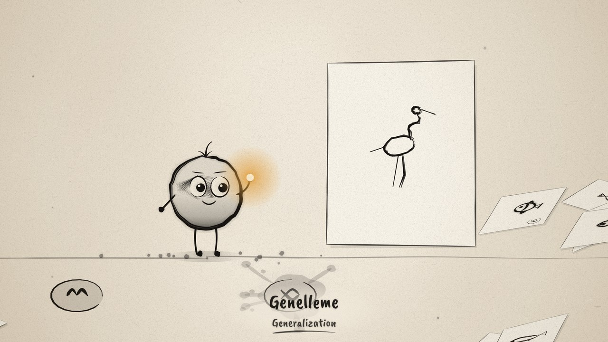
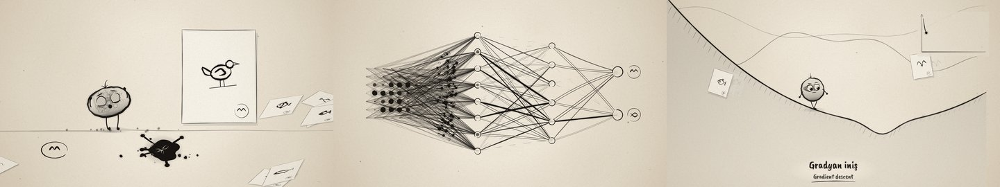

# The Learning Ink · Öğrenen Mürekkep



**▶ Filmi tarayıcıda izleyin / Watch in the browser:** https://hakanatas.github.io/the-learning-ink/
**⬇ MP4 + altyazılar / MP4 + subtitles:** [Releases](https://github.com/hakanatas/the-learning-ink/releases)

> **TR —** Yapay zekânın (bir sinir ağının) nasıl öğrendiğini 12–17 yaş öğrencilere anlatan, tamamen JavaScript ile çizilmiş 90 saniyelik bir mürekkep filmi. Minik mürekkep yaratığı **Nokta** veri görür, yanılır, düzeltilir ve öğrenir; sonunda hiç görmediği bir kuşu tanır ama verisinin dışında kendinden emin şekilde yanılabileceğini de gösterir. Filmdeki sinir ağı gerçektir: sayfa açılırken eğitilir. Altyazılar Türkçe, İngilizce ya da ikisi birlikte seçilebilir; öğretmenler seslendirme ekleyebilsin diye `.srt` dosyaları ve anlatım notları da vardır.



A 90-second procedural ink film about how a neural network learns. Everything on screen is drawn by JavaScript on an HTML5 Canvas 2D. There are no images, no video and no AI-generated assets.

A small ink creature, **Nokta**, is born with a tangled, random mind. It is shown labelled drawings of birds and fish, guesses wrong, gets corrected, and slowly organises itself. At the end it recognises a bird it has never seen, draws one of its own, and then shows that it can still be confidently wrong.

**The network in the film is real.** When the page loads, a tiny neural network (49 → 8 → 6 → 2) is trained deterministically on the same procedural drawings that appear on the sheets. The line thicknesses, the wrong first guess, the forward-pass activations, the loss curve, the correct answer on the unusual heron and the wrong answer on the abstract shape all come from that network.

---

## Run it

| What | How |
|---|---|
| **Preview** | Double-click `index.html` in Chrome, Edge or Firefox. It needs no server and no internet. You can also run `npm run preview` → http://localhost:8080 |
| **Single-file copy** | `npm run bundle` → `dist/learning-ink.html` (everything inlined, so you can email it or copy it to a USB stick) |
| **MP4 export** | `npm install` once, then `npm run export -- --format=horizontal --captions=tr` |
| **Subtitles only** | `npm run srt` → `out/captions_tr.srt`, `_en.srt`, `_bi.srt` and `narration_notes.txt` |

### Export options

```
npm run export -- --format=horizontal|vertical|both  --captions=off|tr|en|bi
                  --fps=30 --crf=18 --preset=slow --workers=3
                  --from=0 --to=90 --frames=png|jpeg --out=out
```

The exporter opens the page in headless Chromium (Playwright). For every frame *n* it calls `renderFrame(n / 30)` and pipes the result losslessly (PNG) into FFmpeg (H.264, yuv420p, faststart). A matching `.srt` is written next to each MP4. Nothing is screen-recorded, so two runs give identical files.
You need FFmpeg: either it is on your PATH, or `npm i ffmpeg-static` is installed, or `FFMPEG_PATH` is set. On a laptop the export takes about 0.1–0.2 s per frame, so 5–10 minutes for the whole film.

### Preview controls

Play/pause (**Space**), restart (**Home**), scrub the timeline (scene markers 1–7), ±1 s (**← →**, with **Shift** ±5 s), frame step (**, .**), jump to a scene, speed ¼×–2×, format 16:9 / 9:16, and captions Off / TR / EN / TR+EN. You can also download the `.srt` or save the current frame as a PNG. The header always shows the current scene and the concept it teaches, in both languages.

---

## Metaphor → real AI concept

Every visual rule stays the same throughout the film, so students learn to "read" the ink.

| Scene | What you see | What it really is |
|---|---|---|
| 1 | A tangled web of thin lines inside Nokta's head | An **untrained network**: weights start as random numbers (He-initialised Gaussian), so they encode nothing yet |
| 2 | Sheets of drawings, each with a small bird/fish symbol in the corner, placed by a human hand | **Training data** and **labels**. People collect and label the examples |
| 2 | Nokta points confidently at FISH for a bird | The real untrained network gives this bird **P(fish) ≈ 0.98**. Random weights can be confidently wrong |
| 2, 4 | An ink blot that cracks | **Error / loss**: the gap between the prediction and the label (cross-entropy) |
| 3 | A bird drawing dissolving into a 7×7 grid of dots | **Input layer**: the image as numbers. Dot size = pixel darkness, computed from the same geometry that is drawn |
| 3 | Line thickness | **Weight magnitude** \|w\|. Thin, broken lines are near-zero weights |
| 3 | Hollow, double-outlined lines | **Negative weights**. In the close-up, a pulse on the hollow line lowers the ink level |
| 3 | Pulses start the same size and swell or shrink along the line | **Input × weight**: each signal is multiplied by the weight it travels through |
| 3 | Ink pooling in the neuron's cup | **Weighted sum** Σ wᵢxᵢ + b |
| 3 | Dashed threshold line; the neuron fires only when the ink passes it | **Activation**. The network uses ReLU: the neuron outputs something only when the weighted sum passes 0, so the bias sets the threshold |
| 3 | Pulses rippling layer by layer; the FISH node fills | The **forward pass**, using the real untrained weights and the real first bird |
| 4 | A pale wash flowing from the output back toward the input; lines thicken or thin as it passes | **Backpropagation**: the gradient of the loss flows backward (chain rule) and every weight moves a little |
| 4 | Terrain where height = error; Nokta steps downhill | The **loss landscape** and **gradient descent**. Steps are computed with uₖ₊₁ = uₖ − η·h′(uₖ), so they shrink as the slope flattens |
| 4 | Nokta overshoots the valley and scrambles back | **Learning rate** too large for the curvature, so it overshoots. The step size is then reduced (learning-rate decay) and it settles |
| 4 | One sheet flicks past per step; an accelerating montage | **Each step = one training example** (stochastic gradient descent, batch size 1, 1,200 steps) |
| 4 | Hand-drawn curve in the corner | The **real loss curve** (mean cross-entropy on a held-out slice of the training set, every 20 steps) |
| 4→5 | Tangle becomes clear, thick pathways | The **trained weights**. A small L1 penalty lets unhelpful connections fade (about 200 strong input weights at the start, about 70 at the end) |
| 5 | Stroke fragments → parts → "bird" | **Feature hierarchy**: early layers respond to simple patterns and deeper layers combine them. *(See the honesty notes below.)* |
| 6 | An unusual heron that no training sheet shows; the BIRD answer fills; the amber light appears | **Generalization**: the real trained network says **bird (P ≈ 0.98)** for a pose it never saw |
| 6 | The amber wave sorts the scattered sheets into groups | The network has learned a **decision boundary** that separates the classes |
| 6 | Faint candidate strokes; Nokta commits to one at a time | A hint of **generative models**: predict the next piece from what came before, sample, repeat |
| 7 | An abstract zig-zag-and-spiral; Nokta says "bird!"; a tiny crack | **Out-of-distribution failure**: the real network calls it bird with **P ≈ 0.9999**. High confidence is not the same as being right |
| 7 | Nokta and the human hand face each other | **Human in the loop**: people choose the data, check the answers and stay responsible |
| 7 | Everything shrinks into a small drawing | The whole model is one small artefact made by people, from data |

### Honesty notes, for teachers

- **Scene 3 close-up**: this neuron is illustrative. It uses three hand-set weights so the arithmetic is easy to follow. The full network views use the real weights.
- **Scene 4 first backward wash**: it shows the change from the start of training to about 3% of the way through (a few dozen examples). One example's update would be too small to see.
- **Scene 5 fragments**: the neuron activations are real, but the tidy stroke/wing/beak pictures are an illustration of the idea. Features learned by a 49-pixel network are blurrier than this.
- **Landscape**: a real network's loss landscape has hundreds of dimensions. The 1-D hill is a metaphor, but the steps on it are real gradient descent on that curve.
- **Scene 6 drawing**: this is a metaphor for autoregressive generation. This classifier cannot generate drawings.
- Network statistics are printed to the browser console on load: training accuracy, test accuracy, and the probabilities quoted above.

---

## Project structure

```
index.html              preview player (also used by the exporter in ?render=1 mode)
captions.js             ★ caption text + timings + narration notes (edit me)
scenes/scene1..7.js     ★ one module per scene: start/end, camera, choreography
src/core/
  timeline.js           master timeline, renderFrame(t), scene registry, colours
  camera.js             virtual camera: pan/zoom/rotate/tilt, parallax depth, dive()
  rng.js                seeded hash randomness + value noise (no Math.random anywhere)
  ease.js               easing, keyframe tracks, bezier/spline helpers
  fonts.js              embedded fonts (Caveat Brush, Fraunces, JetBrains Mono; OFL)
src/ink/
  brush.js              procedural brush: tapered ribbons, dry brush, bleed, dots,
                        ensō rings, blots, cracks, splashes, washes, hollow strokes
  paper.js              seeded paper texture, fibres, grain, vignette
  captions-draw.js      hand-lettered captions with ink-bleed in/out
src/ml/
  sketches.js           procedural bird/fish/abstract drawings + 7×7 rasteriser
  mlp.js                the real network: init, forward, backprop, SGD snapshots
src/draw/
  nokta.js              ★ reusable character rig (see below)
  network.js            ★ reusable network renderer (encoding rules above)
  landscape.js          loss terrain + gradient-descent path
  hand.js, sheet.js, world.js, ambient.js
scripts/                export.mjs, srt.mjs, shots.mjs, bundle.mjs, serve.mjs
```

### Determinism

`renderFrame(t)` is a pure function of `t`, the format and the caption mode. Randomness comes from `LI.rng.rand(...keys)`, a hash, so there is no sequential state. "Training progress" is looked up from pre-computed weight snapshots, so it is never accumulated between frames. Motion follow-through, such as the tuft lag, is computed by sampling the pose function at `t − 0.09 s`, not by remembering the previous frame. Any frame can be rendered in any order.

### The Nokta rig

`LI.Nokta.draw(ctx, pose, t)` takes a plain pose object. It covers position, scale, squash/stretch, lean, crouch, face turn, pupil direction, blink, heavy lids, joyful squint, brows, mouth, hand targets, pointing, holding a brush, and the mind drawn inside the translucent head. Helpers:
- `LI.Nokta.gait(distance, opts)`: a procedural walk cycle. Feet stay planted in world space.
- `LI.Nokta.follow(poseFn, t)`: adds follow-through from velocity and acceleration.
- `LI.Nokta.eyes(pose)`: eye positions, used to aim camera dives.

### The network renderer

`LI.NetDraw.draw(ctx, { q | P, morph, input, fwd, back, Pfrom, Pto, … }, t)` draws the network. `morph` goes from 0 (tangled) to 1 (layered). `fwd` is forward-pass progress (0–3 layers). `back` is backward-wash progress, re-weighting from `Pfrom` to `Pto`. Horizontal and vertical layouts are built in.

### Vertical 9:16

The vertical version is recomposed, not cropped. The network runs top-to-bottom, the landscape is re-proportioned, cameras and positions are chosen per format, and captions sit higher.

---

## Editing tips

- **Change words or timing**: edit `captions.js`, reload, and run `npm run srt`. The `note` field gives a suggested narration line for each caption. There are pacing gaps between concepts for voice-over.
- **Retime a scene**: each scene file keeps its key times near the top, or inline in `camera()` / `pose()` tracks.
- **Different data or network**: the drawing generators are in `src/ml/sketches.js`. `SIZES`, `STEPS`, `LR` and `L1` are in `src/ml/mlp.js`. Everything downstream updates automatically.

Colour rule: the film is ink on paper. The only colour is amber `#E8A33D`, and it appears only at the moment of generalization in Scene 6.
